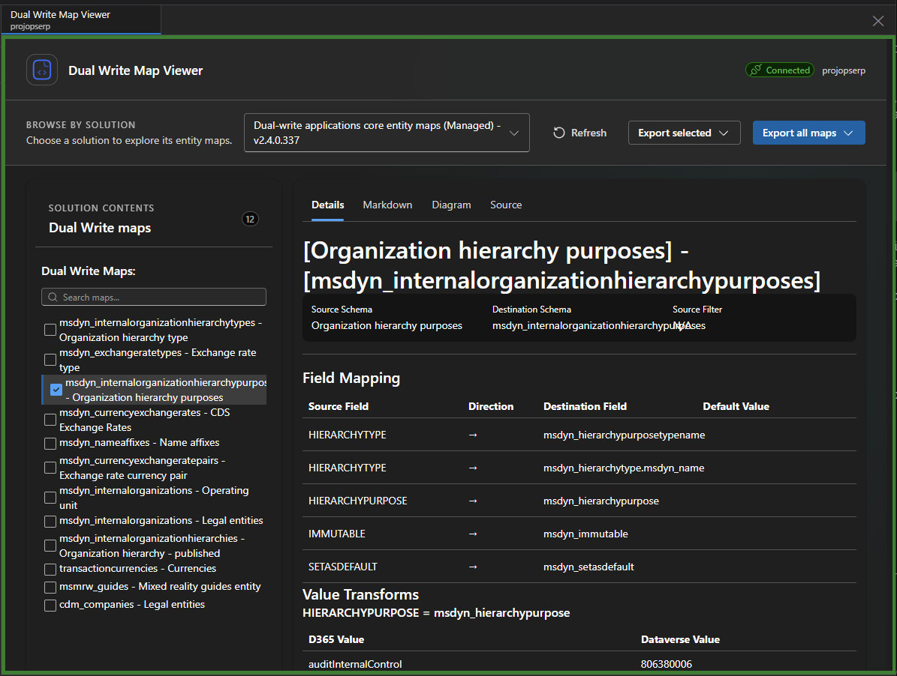
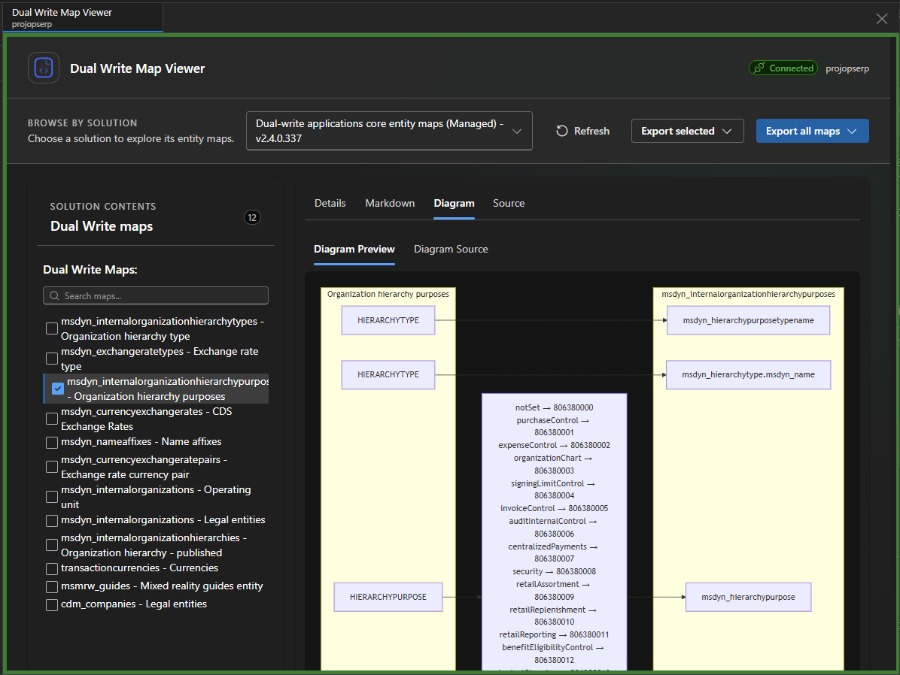

# Dual Write Map Viewer

Dual Write Map Viewer is a Power Platform ToolBox tool for exploring and documenting Microsoft Dataverse Dual Write maps. Choose a solution to browse its maps, inspect how fields synchronize, and export documentation for a selected map or the entire solution.



*Details view: inspect schema information, field mappings, and value transforms.*



*Diagram view: visualize field mappings and value transforms.*

## Features

- **Browse by solution** — Load solutions from the connected Dataverse environment and see the Dual Write maps associated with a selected solution.
- **Inspect map details** — Review source and destination schemas, source filters, field mappings, synchronization direction, default values, and value maps.
- **Read generated documentation** — Preview the generated Markdown, including schema details, source filters, field mappings, and value transforms.
- **View diagrams** — Preview the map as a Mermaid flowchart or inspect its Mermaid source. The diagram includes the source filter as a note.
- **Inspect source data** — View the map's raw JSON.
- **Export maps** — Export the selected map or all maps in the selected solution as Markdown (`.md`), Mermaid (`.mmd`), or both. The tool suggests a filename for a single file and asks for a destination folder when exporting multiple files.
- **Follow ToolBox appearance** — The interface follows the host's light or dark theme and shows connection, loading, and error states.

## Use the tool

1. Open Dual Write Map Viewer in Power Platform ToolBox with a Dataverse environment connected.
2. Choose a solution from **Browse by solution**.
3. Select a map in the **Dual Write maps** panel.
4. Use the **Details**, **Markdown**, **Diagram**, and **Source** tabs to explore the map.
5. Use **Export selected** to export the open map, or **Export all maps** to export every map in the chosen solution. Choose Markdown, Diagram, or Both from the export menu.

For a single selected file, ToolBox opens a save dialog. For a batch export or a Both export, choose a folder; the tool writes separate files for each format and resolves duplicate filenames with numeric suffixes.

## Requirements

- Power Platform ToolBox API 1.2.0 or later (the tool's declared `minAPI`).
- A connected Dataverse environment with access to solutions and Dual Write map records.
- Node.js 18 or later to develop and build the project.

## Project changelog

### 1.1.0 — 2026-10-05

- Added Markdown and Mermaid exports for a selected map or all maps in a solution.
- Added source filters to Markdown and Mermaid diagram views.
- Improved connection feedback, loading states, and the map browsing layout.
- Updated the ToolBox type dependency and replaced deprecated connection typing.

### 1.0.1 — 2026-07-03

- UI improvements.

### 1.0.0 — 2026-07-02

- Added Mermaid diagram generation for Dual Write maps.
- Replaced deprecated loading API usage in the ToolBox integration.

### 0.0.3 — 2026-03-25

- Added solution filtering, interactive map browsing, map details, and Markdown and diagram views.
- Added React, TypeScript, Fluent UI, ToolBox integration, and host theme support.

See [CHANGELOG.md](CHANGELOG.md) for the maintained project history.

## License

This project is licensed under the MIT License. See [LICENSE.md](LICENSE.md).

```text
MIT License

Copyright (c) 2026

Permission is hereby granted, free of charge, to any person obtaining a copy
of this software and associated documentation files (the "Software"), to deal
in the Software without restriction, including without limitation the rights
to use, copy, modify, merge, publish, distribute, sublicense, and/or sell
copies of the Software, and to permit persons to whom the Software is
furnished to do so, subject to the following conditions:

The above copyright notice and this permission notice shall be included in all
copies or substantial portions of the Software.

THE SOFTWARE IS PROVIDED "AS IS", WITHOUT WARRANTY OF ANY KIND, EXPRESS OR
IMPLIED, INCLUDING BUT NOT LIMITED TO THE WARRANTIES OF MERCHANTABILITY,
FITNESS FOR A PARTICULAR PURPOSE AND NONINFRINGEMENT. IN NO EVENT SHALL THE
AUTHORS OR COPYRIGHT HOLDERS BE LIABLE FOR ANY CLAIM, DAMAGES OR OTHER
LIABILITY, WHETHER IN AN ACTION OF CONTRACT, TORT OR OTHERWISE, ARISING FROM,
OUT OF OR IN CONNECTION WITH THE SOFTWARE OR THE USE OR OTHER DEALINGS IN THE
SOFTWARE.
```
